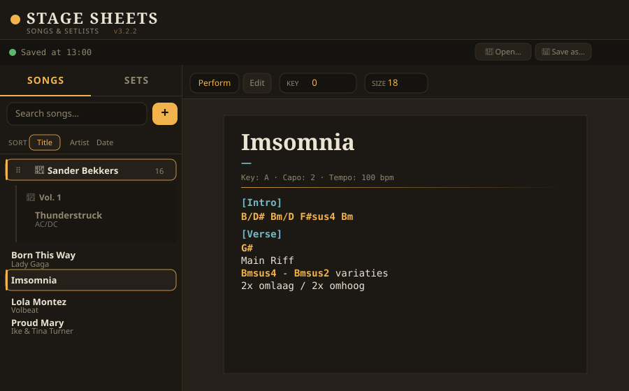
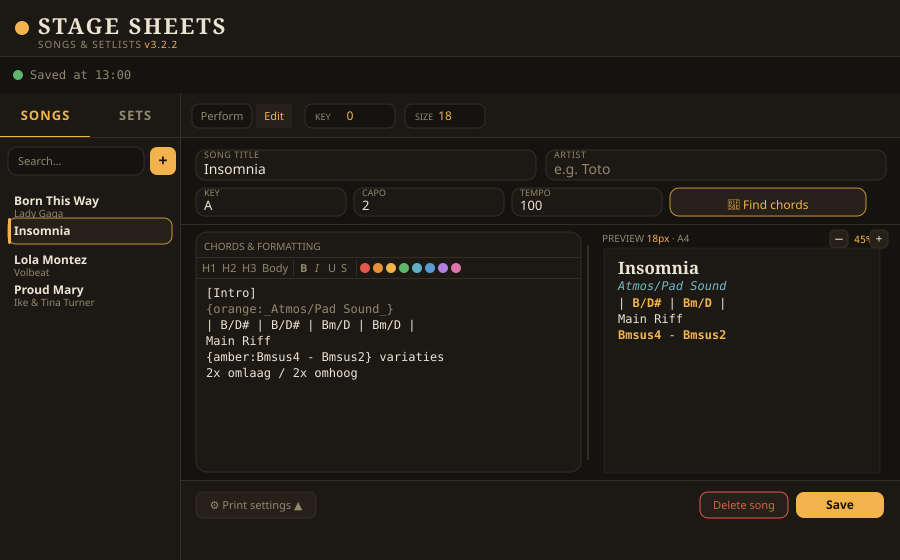
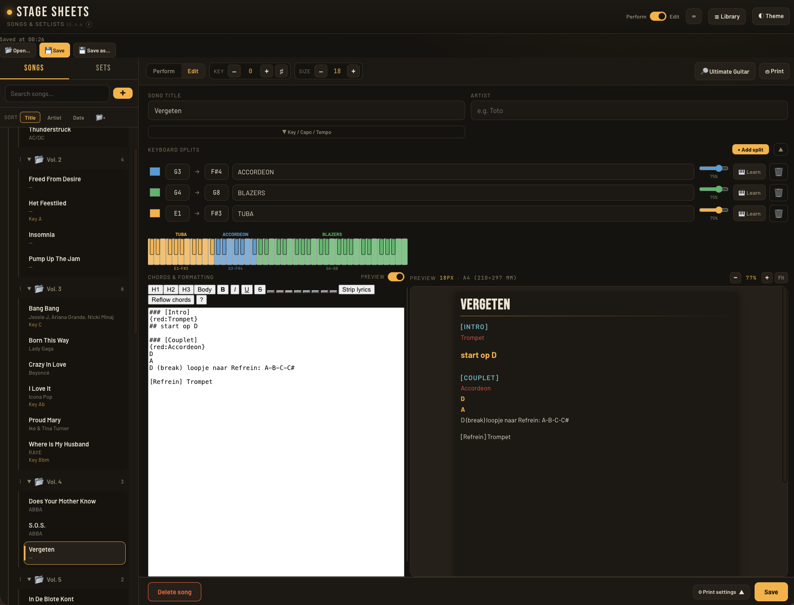

# Stage Sheets

A self-contained, offline-capable chord sheet and setlist manager built for live keyboard performance. No server, no build step, no dependencies — one HTML file.

---

## Screenshots

### Song library & perform view


*Songs organised in folders and subfolders. The perform view renders the song as a physical page card — correct paper size, dark theme, coloured chords.*

### Editor with live preview


*Split-pane editor: raw chord text on the left, live formatted page preview on the right. Drag the divider to resize. The preview matches the selected paper size and print settings exactly.*

---

## Features

### Library
- Song library with **folders and nested subfolders** (up to 3 levels deep)
- Per-song: title, artist, key, capo, tempo, chord sheet, keyboard splits
- **Sort** by title, artist, or date created
- **Search** with inline clear button
- **Archive** songs non-destructively
- **Right-click context menu**: move to folder, add to setlist, archive, delete, new song in folder
- **Drag** songs between folders; drag folders to reorder

### Chord editor
- Monospace textarea with **live preview pane** (split, resizable with drag handle)
- Formatting toolbar: **H1 / H2 / H3** headings, **Bold**, *Italic*, <u>Underline</u>, ~~Strikethrough~~
- **8 colour swatches** + hex colour syntax `{red:text}` or `{#ff8800:text}`
- **Section labels** auto-detected: `[Verse]`, `[Chorus]`, etc.
- **Chord detection** with colouring — standard chords, slash chords (`C/G`, `D/F#`), sus/dim/aug/add, bar notation (`| C | G | Am | F |`)
- **Strip lyrics** — remove lyric lines, keep chords and sections (respects selection)
- **Reflow chords** — redistribute chord tokens into N-per-line (respects selection)
- **Transpose** −/+ semitones with ♯/♭ toggle; per-song transpose memory
- **Find chords** button — opens Ultimate Guitar search for the song
- Collapsible **Key / Capo / Tempo** row to save editor space

### Page preview
- **Word-style multi-page preview** — each page rendered as a separate card with correct margins, gaps between pages like a print layout view
- Element-aware page splitting — no line is ever clipped mid-character between pages
- Zoom controls (−/% /+ /Fit) with stored zoom level
- Resizable split between editor and preview (drag handle)
- Respects individual top/right/bottom/left margins, padding, and font size

### Perform view
- Song renders as a **page on a desk** — correct paper size, shadow, padding
- **Keyboard splits strip** shown below the rule — coloured zones per instrument
- Sheet scroll, **prev/next song** navigation within a setlist
- Keyboard shortcuts: `← →` prev/next, `↑ ↓` transpose, `[ ]` font size
- Configurable **default view** (Perform or Edit) when opening a song
- Tab title shows `Stage Sheets – Song – Artist`

### Keyboard splits

- Define up to **8 keyboard zones** per song, each with a note range and instrument/patch name
- **MIDI Learn** — click Learn, press two keys on your MIDI keyboard to set the range automatically (Chrome/Edge/Brave)
- Individual **colour picker** and **opacity slider** per split
- Visual **SVG keyboard strip** (C2–C8) with per-key colouring shown in editor and perform view
- Collapsible split entry rows — keyboard strip always visible
- Note entry as standard notation: `C3`, `F#4`, `Bb2`

### Setlists
- Create setlists with **sub-setlists** (one level of nesting)
- Proper **breadcrumb navigation** (Sets › Vol.1 › Sub-set)
- **Drag-to-reorder** songs within a setlist
- **Drag-to-reorder** setlists and sub-setlists
- Add songs via right-click → "Add to setlist" from the song library
- **Play set** — opens first song in setlist context, ◀ ▶ navigates through
- **Print set** — prints all songs in the set, one per page

### Print / PDF
- **Print theme**: Light (paper) or Dark (PDF/tablet)
- **Page size**: A4, A5, A3, Letter, Legal, Tabloid, Custom (mm)
- **Individual margins**: top, right, bottom, left — each set independently in mm, with presets (None / Narrow / Normal / Wide)
- **Text padding**: None / Small / Normal / Generous
- **PDF filename**: Artist – Title or Title – Artist
- Prints only the perform view, never the editor
- Print settings hidden in a slide-up panel to maximise editor space

### File management
- **File System Access API** (desktop Chrome/Edge): Open, Save, Save as, Reconnect
- **Fallback** (iOS / Firefox): Load JSON / Save JSON download
- Data file: `stagesheets-data.json` — store on OneDrive for cross-device access
- **Import** via file picker (replaces current library with confirmation)

---

## Usage

### Getting started
1. Download `StageSheets.html` from the [latest release](https://github.com/bartvandegriendt/stagesheets/releases/latest)
2. Open it in **Chrome** or **Edge** (desktop recommended for full FSA support)
3. Click **Save as…** and save `stagesheets-data.json` to your OneDrive folder
4. Add songs with the **+** button, paste chords from [Ultimate Guitar](https://www.ultimate-guitar.com)

### Cross-device workflow
- Edit on your MacBook → **Save** writes to OneDrive automatically
- Open on your tablet → click **Open…** → picks the same JSON from OneDrive automatically
- OneDrive syncs the file; Stage Sheets reads and writes it directly

### Keyboard splits / MIDI Learn
1. In the editor, go to the **Keyboard splits** section
2. Click **+ Add split**
3. Click **🎹 Learn** → button turns teal
4. Press the **lowest key** of the zone on your MIDI keyboard → button turns amber
5. Press the **highest key** → range is set, keyboard strip updates live
6. Type the instrument/patch name and pick a colour

### Chord syntax
```
[Verse]
G                D
I found a love for me
Em               C
Darling just dive right in
```

### Formatting syntax
| Syntax | Result |
|---|---|
| `# Title` | H1 heading |
| `## Section` | H2 heading |
| `### Note` | H3 heading |
| `**text**` | **Bold** |
| `_text_` | *Italic* |
| `__text__` | Underlined |
| `~~text~~` | ~~Strikethrough~~ |
| `{red:text}` | Coloured text |
| `{#ff8800:text}` | Hex colour |
| `[Verse]` | Auto-styled section label |

### Keyboard shortcuts
| Key | Action |
|---|---|
| `← →` | Previous / next song (in a setlist) |
| `↑ ↓` | Transpose up / down |
| `[ ]` | Smaller / larger text |

---

## Browser support

| Browser | File access | MIDI Learn | Notes |
|---|---|---|---|
| Chrome (desktop) | ✅ Full FSA | ✅ | Recommended |
| Edge (desktop) | ✅ Full FSA | ✅ | Recommended |
| Brave (desktop) | ✅ Full FSA | ✅ | |
| Safari (desktop) | ⚠️ Partial | ❌ | FSA support varies |
| Firefox | ❌ No FSA | ❌ | Use Load/Save JSON buttons |
| Chrome iOS | ❌ No FSA | ❌ | Use Load/Save JSON buttons |
| Edge iOS | ❌ No FSA | ❌ | Use Load/Save JSON buttons |

All browsers can use the app fully — FSA and MIDI limitations only affect file write and MIDI Learn. On non-FSA browsers, use **Save JSON** to download and **Load JSON** to import.

---

## File structure

```
stagesheets/
├── StageSheets.html        # The entire application (single file)
├── README.md               # This file
├── CHANGELOG.md            # Version history
└── screenshots/
    ├── library-perform.svg
    └── editor-preview.svg
```

The JSON data file lives separately (on OneDrive or wherever you choose) and is never committed to the repo — it contains your personal song library.

---

## Development

The app is intentionally a single HTML file with no build step, no bundler, and no external dependencies (fonts are loaded from Google Fonts when online; the app works offline otherwise).

The `<script>` block is divided into labelled regions for navigation:

- `FILE SYSTEM ACCESS & PROJECT BAR`
- `DATABASE`
- `MUSIC THEORY` — chord detection, transpose, render
- `STATE` — variables, persist, load
- `SIDEBAR` — songs, folders, drag-drop, context menus
- `MAIN` — perform view, editor, toolbar
- `NAVIGATION` — openSong, addSong, setlist navigation
- `PRINT & PAGE SETTINGS`
- `FILE I/O` — import, export, FSA open/save

To edit: open `StageSheets.html` in VS Code. Use the region comments to navigate. No npm, no terminal needed.

### Deploying to a web server via Git

```bash
# One-time setup on your server
cd /your/web/root
git clone https://github.com/bartvandegriendt/stagesheets.git .

# After every push — pull the latest version
git pull
```

Or add a cron job to auto-pull every 5 minutes:
```
*/5 * * * * cd /your/web/root && git pull
```

---

## Version

Current version is shown in the top bar next to "SONGS & SETLISTS". Click the **ⓘ** button for a changelog of recent updates, or view the [full commit history](https://github.com/bartvandegriendt/stagesheets/commits/main/) on GitHub.

See [CHANGELOG.md](CHANGELOG.md) for the full version history.

---

## Releases

Stable releases are published at [github.com/bartvandegriendt/stagesheets/releases](https://github.com/bartvandegriendt/stagesheets/releases). Each release includes `StageSheets.html` as a direct download — no cloning required.

---

## License

Personal use. Not for redistribution.
